# Workflows des Fonctionnalités de DaybydayCRM

Ce document décrit en détail le déroulement des principales fonctionnalités de l'application DaybydayCRM, en précisant les classes et méthodes impliquées à chaque étape.

## Vue d'ensemble du Système

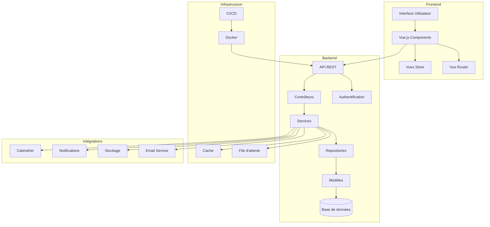

## Table des matières
1. [Authentification](#authentification)
2. [Gestion des Clients](#gestion-des-clients)
3. [Gestion des Projets](#gestion-des-projets)
4. [Gestion des Tâches](#gestion-des-tâches)
5. [Facturation](#facturation)
6. [Rapports et Tableau de Bord](#rapports-et-tableau-de-bord)
7. [Notifications](#notifications)
8. [Gestion des Documents](#gestion-des-documents)
9. [Gestion des Contacts](#gestion-des-contacts)
10. [Gestion des Calendriers](#gestion-des-calendriers)
11. [Gestion des Emails](#gestion-des-emails)
12. [Gestion des Rappels](#gestion-des-rappels)
13. [Gestion des Notes](#gestion-des-notes)
14. [Gestion des Tags](#gestion-des-tags)
15. [Gestion des Permissions](#gestion-des-permissions)
16. [Gestion des API](#gestion-des-api)
17. [Gestion des Intégrations](#gestion-des-intégrations)
18. [Gestion des Sauvegardes](#gestion-des-sauvegardes)
19. [Gestion des Logs](#gestion-des-logs)
20. [Gestion des Paramètres](#gestion-des-paramètres)

## Authentification

### Connexion (Login)

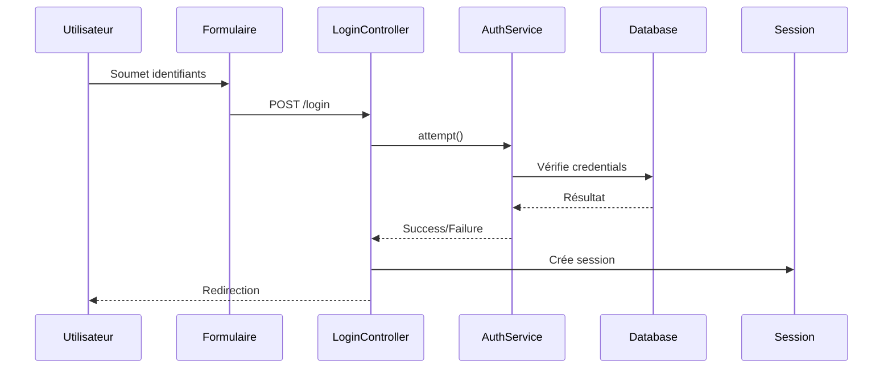

1. **Soumission du formulaire**
   - L'utilisateur soumet le formulaire de connexion sur `/login`
   - La requête est envoyée à `LoginController@login`

2. **Validation des identifiants**
   - `LoginController@login` utilise le service `AuthenticationService@attempt`
   - Les identifiants sont validés via `Auth::attempt()`

3. **Création de session**
   - Si les identifiants sont valides, `SessionGuard@login` crée une session
   - Un token CSRF est régénéré pour la sécurité

4. **Redirection**
   - Redirection vers `DashboardController@index` ou la page demandée précédemment
   - Middleware `RedirectIfAuthenticated` empêche l'accès aux pages de connexion si déjà connecté

### Déconnexion (Logout)

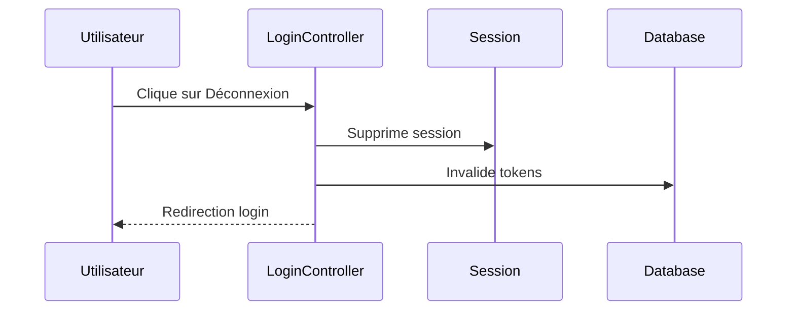

1. **Demande de déconnexion**
   - L'utilisateur clique sur "Déconnexion"
   - La requête est envoyée à `LoginController@logout`

2. **Suppression de session**
   - `Auth::logout()` est appelé pour supprimer la session
   - Les cookies d'authentification sont invalidés

3. **Redirection**
   - Redirection vers `LoginController@showLoginForm`

## Gestion des Clients

### Création d'un Client

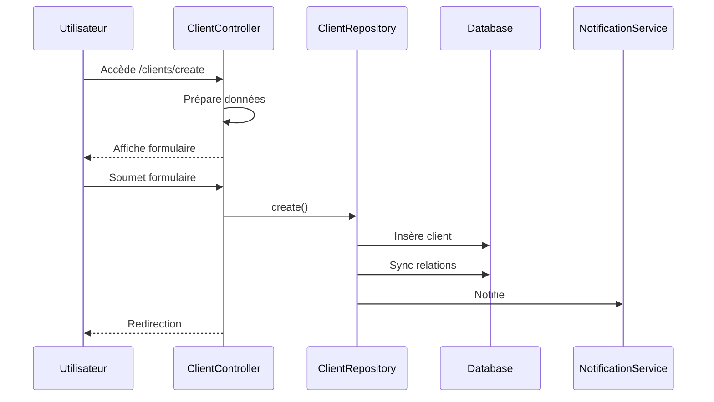

1. **Initialisation du formulaire**
   - L'utilisateur accède à `/clients/create`
   - La requête est traitée par `ClientController@create`

2. **Soumission du formulaire**
   - Les données sont envoyées à `ClientController@store`
   - `ClientRequest` valide les données d'entrée

3. **Création en base de données**
   - `ClientRepository@create` est appelé avec les données validées
   - Un nouvel objet `Client` est créé et persisté

4. **Association des relations**
   - Les industries associées sont sauvegardées via `ClientRepository@syncIndustries`
   - Les utilisateurs responsables sont assignés via `ClientRepository@syncUsers`

5. **Notification**
   - `NotificationRepository@create` enregistre une notification pour les utilisateurs concernés
   - Le service `PushNotificationService` envoie une notification push si configuré

6. **Redirection**
   - Redirection vers `ClientController@show` avec un message de succès

### Mise à jour d'un Client

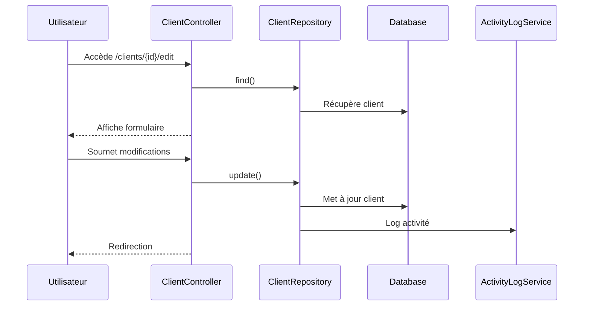

1. **Chargement du formulaire**
   - L'utilisateur accède à `/clients/{id}/edit`
   - `ClientController@edit` récupère le client via `ClientRepository@find`

2. **Soumission du formulaire**
   - Les données sont envoyées à `ClientController@update`
   - `ClientRequest` valide les données d'entrée

3. **Mise à jour en base de données**
   - `ClientRepository@update` met à jour les attributs du client
   - Les relations sont synchronisées (industries, utilisateurs)

4. **Journalisation**
   - `ActivityLogService@log` enregistre l'activité de modification
   - Les informations sont stockées dans la table `activity_log`

### Suppression d'un Client

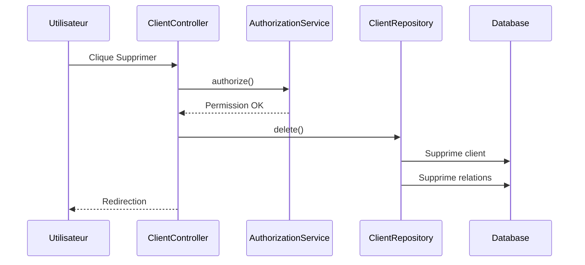

1. **Demande de suppression**
   - L'utilisateur clique sur "Supprimer" sur `/clients/{id}`
   - La requête est envoyée à `ClientController@destroy`

2. **Vérification des permissions**
   - `AuthorizationService@authorize` vérifie les droits de l'utilisateur
   - Le middleware `Can` s'assure que l'utilisateur a la permission "client-delete"

3. **Suppression en base de données**
   - `ClientRepository@delete` supprime le client
   - Suppression en cascade des relations configurées

## Gestion des Projets

### Création d'un Projet

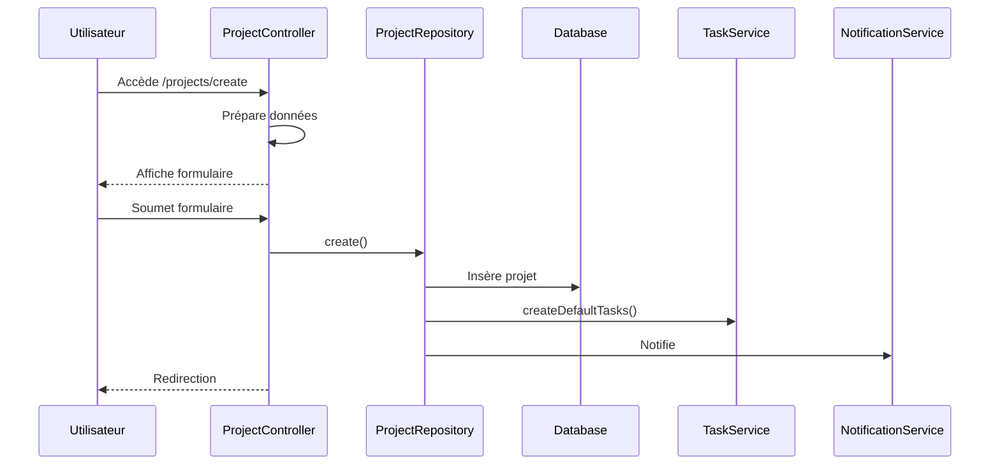

1. **Initialisation du formulaire**
   - L'utilisateur accède à `/projects/create`
   - `ProjectController@create` prépare les données nécessaires (clients, statuts)

2. **Soumission du formulaire**
   - Les données sont envoyées à `ProjectController@store`
   - `ProjectRequest` valide les entrées

3. **Création en base de données**
   - `ProjectRepository@create` crée un nouvel objet `Project`
   - Les attributs sont définis via `fill()` puis `save()`

4. **Association des relations**
   - Les utilisateurs sont assignés via `ProjectRepository@syncUsers`
   - Les tâches initiales sont créées via `TaskService@createDefaultTasks`

5. **Notification**
   - `NotificationRepository@create` crée des notifications
   - Des emails sont envoyés via `ProjectCreatedMailService@send`

### Suivi du Temps sur un Projet

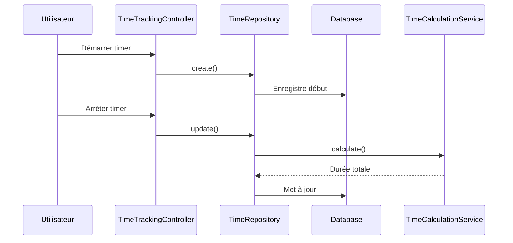

1. **Démarrage du suivi**
   - L'utilisateur clique sur "Démarrer le timer" sur `/projects/{id}`
   - La requête est envoyée à `TimeTrackingController@start`

2. **Création d'un enregistrement de temps**
   - `TimeRepository@create` crée un nouveau `TimeRegistration`
   - L'heure de début est enregistrée

3. **Arrêt du suivi**
   - L'utilisateur clique sur "Arrêter le timer"
   - `TimeTrackingController@stop` est appelé

4. **Finalisation de l'enregistrement**
   - `TimeRepository@update` met à jour l'heure de fin
   - La durée totale est calculée via `TimeCalculationService@calculate`

## Gestion des Tâches

### Création d'une Tâche

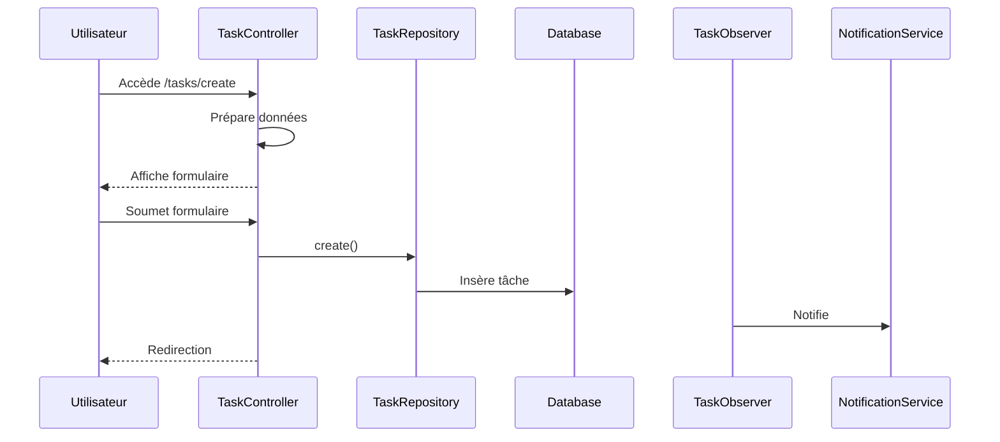

1. **Initialisation du formulaire**
   - L'utilisateur accède à `/tasks/create`
   - `TaskController@create` prépare les données (projets, statuts, priorités)

2. **Soumission du formulaire**
   - Les données sont envoyées à `TaskController@store`
   - `TaskRequest` valide les entrées

3. **Création en base de données**
   - `TaskRepository@create` crée un nouvel objet `Task`
   - Les attributs sont définis et sauvegardés

4. **Notification**
   - `TaskObserver@created` déclenche des notifications
   - `TaskCreatedMailService@send` envoie des emails aux assignés

### Changement de Statut d'une Tâche

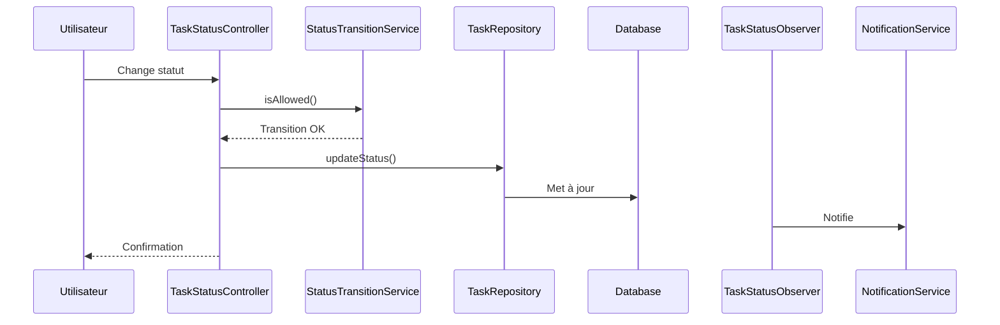

1. **Mise à jour du statut**
   - L'utilisateur change le statut dans l'interface
   - La requête est envoyée à `TaskStatusController@update`

2. **Validation du changement**
   - `StatusTransitionService@isAllowed` vérifie si la transition est permise
   - Les contraintes de workflow sont appliquées

3. **Mise à jour en base de données**
   - `TaskRepository@updateStatus` met à jour le statut
   - L'historique de statut est enregistré via `StatusHistoryRepository@create`

4. **Notification**
   - `TaskStatusObserver@updated` déclenche des notifications
   - Les intéressés sont notifiés du changement

## Facturation

### Création d'une Facture

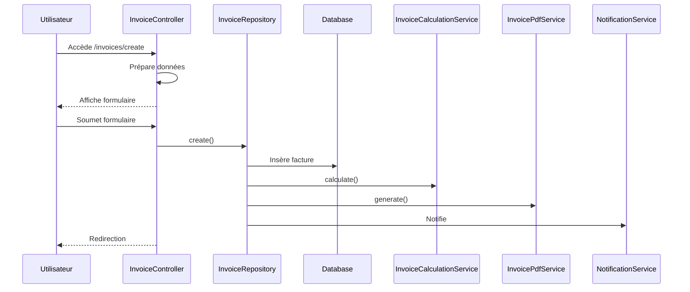

1. **Initialisation du formulaire**
   - L'utilisateur accède à `/invoices/create`
   - `InvoiceController@create` prépare les données (clients, services)

2. **Soumission du formulaire**
   - Les données sont envoyées à `InvoiceController@store`
   - `InvoiceRequest` valide les entrées

3. **Création en base de données**
   - `InvoiceRepository@create` crée un nouvel objet `Invoice`
   - Les lignes de facture sont créées via `InvoiceLineRepository@createMany`

4. **Calcul des montants**
   - `InvoiceCalculationService@calculate` détermine les sous-totaux, taxes et total
   - Les montants sont enregistrés dans l'objet `Invoice`

5. **Génération du PDF**
   - `InvoicePdfService@generate` crée le PDF de la facture
   - Le fichier est stocké dans `storage/app/invoices`

6. **Notification**
   - Des emails peuvent être envoyés via `InvoiceCreatedMailService@send`
   - Le client est notifié si l'option est activée

### Paiement d'une Facture

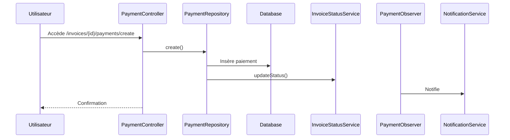

1. **Enregistrement du paiement**
   - L'utilisateur accède à `/invoices/{id}/payments/create`
   - `PaymentController@store` traite les données du paiement

2. **Mise à jour du statut**
   - `PaymentRepository@create` enregistre le paiement
   - `InvoiceStatusService@updateStatus` met à jour le statut de la facture

3. **Notification**
   - `PaymentObserver@created` déclenche des notifications
   - Des reçus peuvent être envoyés via `ReceiptService@generate`

## Rapports et Tableau de Bord

### Génération de Rapports

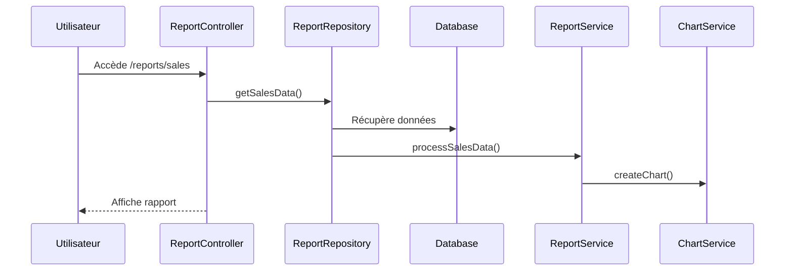

1. **Demande de rapport**
   - L'utilisateur accède à `/reports/sales`
   - `ReportController@sales` traite la demande

2. **Récupération des données**
   - `ReportRepository@getSalesData` récupère les données brutes
   - Des filtres sont appliqués selon les paramètres

3. **Traitement des données**
   - `ReportService@processSalesData` agrège et formate les données
   - Des calculs statistiques sont effectués

4. **Rendu des résultats**
   - Les données sont transmises à la vue
   - Des graphiques sont générés via `ChartService@createChart`

### Affichage du Tableau de Bord

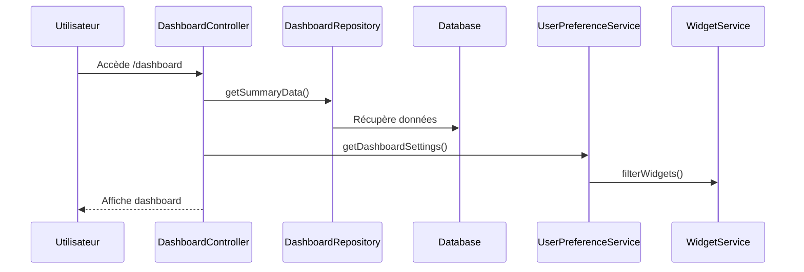

1. **Chargement du tableau de bord**
   - L'utilisateur accède à `/dashboard`
   - `DashboardController@index` traite la requête

2. **Récupération des données**
   - `DashboardRepository@getSummaryData` obtient les données résumées
   - Plusieurs sources de données sont consolidées

3. **Personnalisation**
   - `UserPreferenceService@getDashboardSettings` récupère les préférences
   - Les widgets sont filtrés selon les préférences

4. **Rendu du tableau de bord**
   - Les données sont transmises à la vue
   - Les widgets sont rendus avec leurs données respectives

## Notifications

### Envoi de Notifications

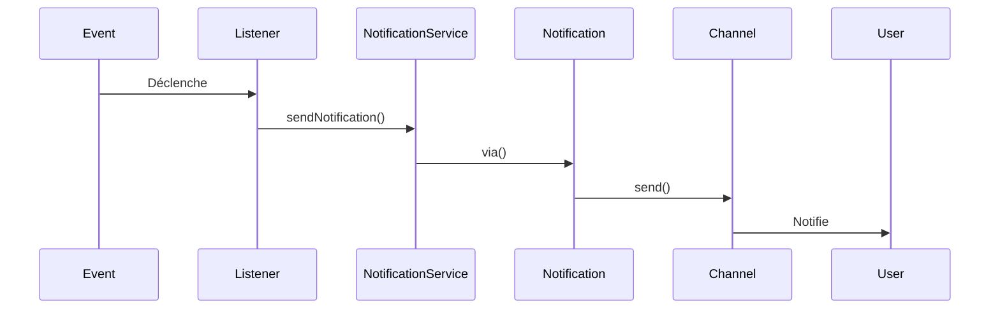

1. **Déclenchement d'un événement**
   - Un événement comme `TaskAssigned` est déclenché
   - `EventServiceProvider` associe l'événement aux listeners appropriés

2. **Traitement par les listeners**
   - `TaskAssignedListener@handle` traite l'événement
   - `NotificationService@sendTaskAssignedNotification` est appelé

3. **Création des notifications**
   - `TaskAssignedNotification@via` détermine les canaux de notification
   - Les notifications sont envoyées via les canaux configurés (base de données, email, etc.)

4. **Envoi aux destinataires**
   - `Notification::send($users, new TaskAssignedNotification($task))` envoie les notifications
   - Chaque canal traite l'envoi selon sa méthode propre

### Lecture des Notifications

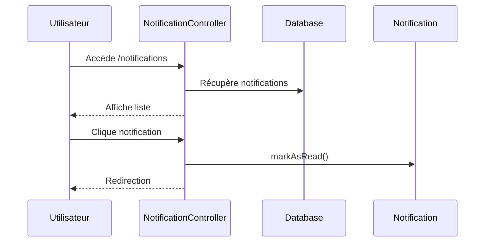

1. **Réception des notifications**
   - L'utilisateur accède à `/notifications`
   - `NotificationController@index` récupère les notifications via `auth()->user()->notifications`

2. **Marquage comme lue**
   - L'utilisateur clique sur une notification
   - `NotificationController@markAsRead` met à jour le statut via `$notification->markAsRead()`

3. **Redirection**
   - L'utilisateur est redirigé vers l'URL associée à la notification
   - Le contexte approprié est affiché

## Gestion des Documents

### Upload de Documents

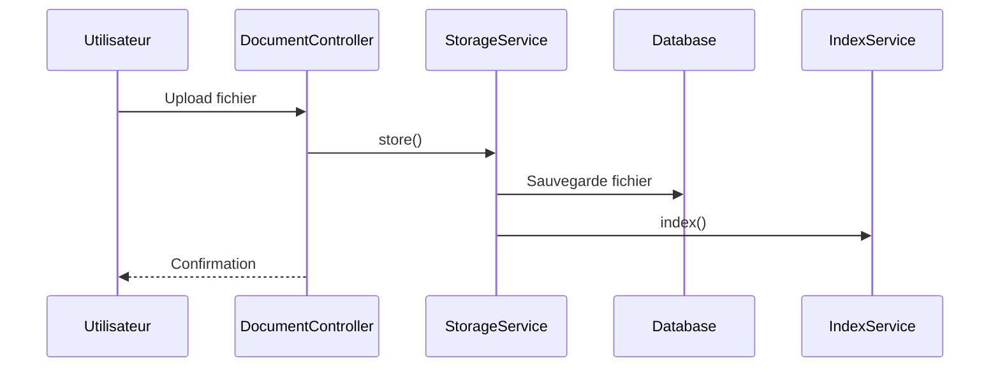

1. **Sélection du fichier**
   - L'utilisateur sélectionne un fichier via l'interface
   - Le fichier est validé par `DocumentRequest`

2. **Traitement du fichier**
   - `DocumentController@store` traite l'upload
   - `StorageService@store` sauvegarde le fichier

3. **Indexation**
   - `IndexService@index` indexe le contenu du document
   - Les métadonnées sont extraites et stockées

4. **Association**
   - Le document est associé à l'entité appropriée (client, projet, etc.)
   - Les permissions sont définies

### Recherche de Documents

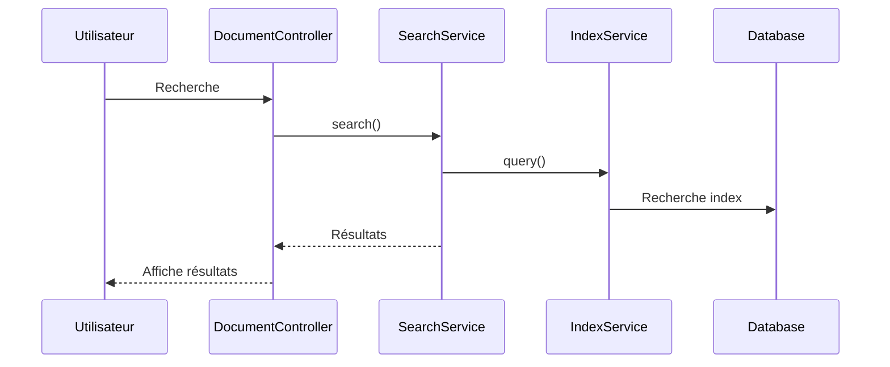

1. **Soumission de la recherche**
   - L'utilisateur entre des termes de recherche
   - La requête est envoyée à `DocumentController@search`

2. **Traitement de la recherche**
   - `SearchService@search` traite la requête
   - `IndexService@query` recherche dans l'index

3. **Filtrage des résultats**
   - Les résultats sont filtrés selon les permissions
   - Les documents sont triés par pertinence

4. **Affichage**
   - Les résultats sont paginés
   - Les aperçus sont générés

## Gestion des Contacts

### Création d'un Contact

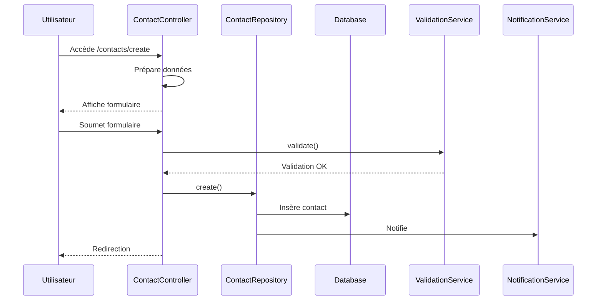

1. **Initialisation du formulaire**
   - L'utilisateur accède à `/contacts/create`
   - `ContactController@create` prépare les données

2. **Validation des données**
   - `ContactRequest` valide les entrées
   - `ValidationService@validate` effectue des validations supplémentaires

3. **Création en base de données**
   - `ContactRepository@create` crée le contact
   - Les relations sont établies

4. **Notification**
   - Les intéressés sont notifiés
   - Un email de bienvenue peut être envoyé

### Import de Contacts

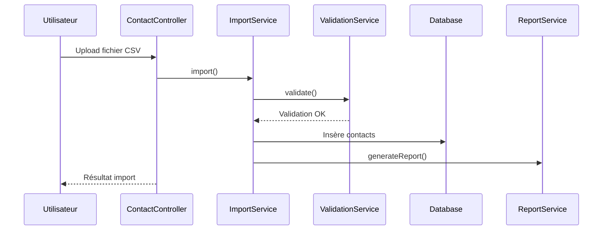

1. **Upload du fichier**
   - L'utilisateur upload un fichier CSV
   - Le fichier est validé par `ImportService`

2. **Traitement des données**
   - Les données sont parsées et validées
   - Les doublons sont détectés

3. **Import en base de données**
   - Les contacts sont créés en masse
   - Les erreurs sont enregistrées

4. **Rapport d'import**
   - Un rapport est généré
   - Les erreurs sont affichées

## Gestion des Calendriers

### Création d'un Événement

```mermaid
sequenceDiagram
    participant U as Utilisateur
    participant C as CalendarController
    participant R as EventRepository
    participant D as Database
    participant S as SchedulingService
    participant N as NotificationService

    U->>C: Accède /calendar/events/create
    C->>C: Prépare données
    C-->>U: Affiche formulaire
    U->>C: Soumet formulaire
    C->>R: create()
    R->>D: Insère événement
    R->>S: checkConflicts()
    R->>N: Notifie participants
    C-->>U: Confirmation
```

1. **Initialisation du formulaire**
   - L'utilisateur accède à `/calendar/events/create`
   - `CalendarController@create` prépare les données

2. **Validation des données**
   - `EventRequest` valide les entrées
   - `SchedulingService@checkConflicts` vérifie les conflits

3. **Création de l'événement**
   - `EventRepository@create` crée l'événement
   - Les participants sont associés

4. **Notification**
   - Les participants sont notifiés
   - Des rappels sont configurés

### Synchronisation Calendrier

```mermaid
sequenceDiagram
    participant U as Utilisateur
    participant C as CalendarController
    participant S as SyncService
    participant P as Provider
    participant D as Database

    U->>C: Demande sync
    C->>S: sync()
    S->>P: fetchEvents()
    P-->>S: Événements
    S->>D: Met à jour
    S-->>C: Résultat
    C-->>U: Confirmation
```

1. **Démarrage de la synchronisation**
   - L'utilisateur demande la synchronisation
   - `CalendarController@sync` initie le processus

2. **Récupération des données**
   - `SyncService@sync` récupère les événements
   - Les données sont normalisées

3. **Mise à jour de la base de données**
   - Les événements sont mis à jour
   - Les conflits sont résolus

4. **Confirmation**
   - Le résultat est affiché
   - Les erreurs sont signalées

## Gestion des Emails

### Envoi d'Email

```mermaid
sequenceDiagram
    participant U as Utilisateur
    participant C as EmailController
    participant S as EmailService
    participant Q as Queue
    participant M as Mailer
    participant R as Recipient

    U->>C: Compose email
    C->>S: send()
    S->>Q: queue()
    Q->>M: process()
    M->>R: deliver()
    C-->>U: Confirmation
```

1. **Composition de l'email**
   - L'utilisateur compose l'email
   - `EmailController@create` prépare l'interface

2. **Validation et envoi**
   - `EmailRequest` valide les données
   - `EmailService@send` traite l'envoi

3. **Mise en file d'attente**
   - L'email est mis en file d'attente
   - `QueueService` gère la distribution

4. **Livraison**
   - L'email est envoyé
   - Le statut est mis à jour

### Réception d'Email

```mermaid
sequenceDiagram
    participant M as Mailbox
    participant S as EmailService
    participant P as Parser
    participant D as Database
    participant N as NotificationService

    M->>S: Nouvel email
    S->>P: parse()
    P->>D: store()
    S->>N: notify()
    S-->>M: Confirmation
```

1. **Réception**
   - L'email est reçu
   - `EmailService@receive` traite l'email

2. **Traitement**
   - `ParserService@parse` analyse l'email
   - Les pièces jointes sont extraites

3. **Stockage**
   - L'email est stocké en base de données
   - Les relations sont établies

4. **Notification**
   - Les destinataires sont notifiés
   - Des actions automatiques sont déclenchées

## Gestion des Rappels

### Création d'un Rappel

```mermaid
sequenceDiagram
    participant U as Utilisateur
    participant C as ReminderController
    participant R as ReminderRepository
    participant D as Database
    participant S as SchedulingService
    participant Q as Queue

    U->>C: Crée rappel
    C->>R: create()
    R->>D: Insère rappel
    R->>S: schedule()
    S->>Q: queue()
    C-->>U: Confirmation
```

1. **Initialisation**
   - L'utilisateur crée un rappel
   - `ReminderController@create` traite la requête

2. **Validation**
   - `ReminderRequest` valide les données
   - `SchedulingService@validate` vérifie la planification

3. **Création**
   - `ReminderRepository@create` crée le rappel
   - La planification est configurée

4. **Planification**
   - Le rappel est mis en file d'attente
   - La notification est programmée

### Traitement d'un Rappel

```mermaid
sequenceDiagram
    participant Q as Queue
    participant S as ReminderService
    participant N as NotificationService
    participant D as Database
    participant U as User

    Q->>S: Déclenche rappel
    S->>N: send()
    N->>U: Notifie
    S->>D: updateStatus()
    S-->>Q: Confirmation
```

1. **Déclenchement**
   - Le rappel est déclenché
   - `ReminderService@process` traite le rappel

2. **Notification**
   - `NotificationService@send` envoie la notification
   - Les canaux appropriés sont utilisés

3. **Mise à jour**
   - Le statut est mis à jour
   - L'historique est enregistré

4. **Confirmation**
   - Le traitement est confirmé
   - Les erreurs sont signalées

## Gestion des Notes

### Création d'une Note

```mermaid
sequenceDiagram
    participant U as Utilisateur
    participant C as NoteController
    participant R as NoteRepository
    participant D as Database
    participant V as ValidationService
    participant I as IndexService

    U->>C: Crée note
    C->>V: validate()
    V-->>C: Validation OK
    C->>R: create()
    R->>D: Insère note
    R->>I: index()
    C-->>U: Confirmation
```

1. **Initialisation**
   - L'utilisateur crée une note
   - `NoteController@create` traite la requête

2. **Validation**
   - `NoteRequest` valide les données
   - `ValidationService@validate` effectue des validations supplémentaires

3. **Création**
   - `NoteRepository@create` crée la note
   - Les relations sont établies

4. **Indexation**
   - Le contenu est indexé
   - Les métadonnées sont extraites

### Recherche de Notes

```mermaid
sequenceDiagram
    participant U as Utilisateur
    participant C as NoteController
    participant S as SearchService
    participant I as IndexService
    participant D as Database

    U->>C: Recherche
    C->>S: search()
    S->>I: query()
    I->>D: Recherche index
    S-->>C: Résultats
    C-->>U: Affiche résultats
```

1. **Soumission de la recherche**
   - L'utilisateur recherche des notes
   - `NoteController@search` traite la requête

2. **Traitement**
   - `SearchService@search` effectue la recherche
   - `IndexService@query` interroge l'index

3. **Filtrage**
   - Les résultats sont filtrés
   - Les permissions sont vérifiées

4. **Affichage**
   - Les résultats sont affichés
   - La pagination est gérée

## Gestion des Tags

### Création d'un Tag

```mermaid
sequenceDiagram
    participant U as Utilisateur
    participant C as TagController
    participant R as TagRepository
    participant D as Database
    participant V as ValidationService

    U->>C: Crée tag
    C->>V: validate()
    V-->>C: Validation OK
    C->>R: create()
    R->>D: Insère tag
    C-->>U: Confirmation
```

1. **Initialisation**
   - L'utilisateur crée un tag
   - `TagController@create` traite la requête

2. **Validation**
   - `TagRequest` valide les données
   - `ValidationService@validate` vérifie les contraintes

3. **Création**
   - `TagRepository@create` crée le tag
   - Les relations sont établies

4. **Confirmation**
   - Le tag est créé
   - L'interface est mise à jour

### Association de Tags

```mermaid
sequenceDiagram
    participant U as Utilisateur
    participant C as TagController
    participant R as TagRepository
    participant D as Database
    participant S as SyncService

    U->>C: Associe tags
    C->>R: sync()
    R->>D: Met à jour relations
    R->>S: syncIndex()
    C-->>U: Confirmation
```

1. **Sélection des tags**
   - L'utilisateur sélectionne des tags
   - `TagController@sync` traite la requête

2. **Mise à jour**
   - `TagRepository@sync` met à jour les relations
   - Les anciennes relations sont nettoyées

3. **Indexation**
   - `SyncService@syncIndex` met à jour l'index
   - Les recherches sont optimisées

4. **Confirmation**
   - Les associations sont confirmées
   - L'interface est mise à jour

## Gestion des Permissions

### Attribution de Permissions

```mermaid
sequenceDiagram
    participant A as Admin
    participant C as PermissionController
    participant R as RoleRepository
    participant D as Database
    participant V as ValidationService

    A->>C: Attribue permission
    C->>V: validate()
    V-->>C: Validation OK
    C->>R: assign()
    R->>D: Met à jour
    C-->>A: Confirmation
```

1. **Sélection des permissions**
   - L'administrateur sélectionne les permissions
   - `PermissionController@assign` traite la requête

2. **Validation**
   - `PermissionRequest` valide les données
   - `ValidationService@validate` vérifie les contraintes

3. **Attribution**
   - `RoleRepository@assign` attribue les permissions
   - Les relations sont mises à jour

4. **Confirmation**
   - Les permissions sont attribuées
   - Les changements sont enregistrés

### Vérification des Permissions

```mermaid
sequenceDiagram
    participant U as User
    participant M as Middleware
    participant S as PermissionService
    participant D as Database
    participant R as Response

    U->>M: Accède ressource
    M->>S: check()
    S->>D: Vérifie permissions
    S-->>M: Résultat
    M-->>U: Accès accordé/refusé
```

1. **Requête d'accès**
   - L'utilisateur tente d'accéder à une ressource
   - Le middleware intercepte la requête

2. **Vérification**
   - `PermissionService@check` vérifie les permissions
   - Les rôles sont vérifiés

3. **Décision**
   - L'accès est accordé ou refusé
   - La réponse est générée

4. **Action**
   - L'utilisateur est redirigé ou autorisé
   - Les logs sont enregistrés

## Gestion des API

### Authentification API

```mermaid
sequenceDiagram
    participant C as Client
    participant A as AuthController
    participant S as TokenService
    participant D as Database
    participant R as Response

    C->>A: Demande token
    A->>S: generate()
    S->>D: Stocke token
    S-->>A: Token
    A-->>C: Token
```

1. **Demande de token**
   - Le client demande un token
   - `AuthController@token` traite la requête

2. **Génération**
   - `TokenService@generate` crée un token
   - Les permissions sont associées

3. **Stockage**
   - Le token est stocké en base de données
   - Les métadonnées sont enregistrées

4. **Réponse**
   - Le token est renvoyé au client
   - Les instructions d'utilisation sont fournies

### Utilisation de l'API

```mermaid
sequenceDiagram
    participant C as Client
    participant M as Middleware
    participant S as ApiService
    participant D as Database
    participant R as Response

    C->>M: Requête API
    M->>M: Valide token
    M->>S: Traite requête
    S->>D: Accède données
    S-->>R: Formate réponse
    R-->>C: Résultat
```

1. **Validation du token**
   - Le middleware vérifie le token
   - Les permissions sont validées

2. **Traitement de la requête**
   - `ApiService` traite la requête
   - Les paramètres sont validés

3. **Accès aux données**
   - Les données sont récupérées
   - Les relations sont chargées

4. **Réponse**
   - Les données sont formatées
   - Le résultat est renvoyé

## Gestion des Intégrations

### Configuration d'une Intégration

```mermaid
sequenceDiagram
    participant U as Utilisateur
    participant C as IntegrationController
    participant S as IntegrationService
    participant V as ValidationService
    participant D as Database

    U->>C: Configure intégration
    C->>V: validate()
    V-->>C: Validation OK
    C->>S: setup()
    S->>D: Stocke config
    C-->>U: Confirmation
```

1. **Initialisation**
   - L'utilisateur configure l'intégration
   - `IntegrationController@setup` traite la requête

2. **Validation**
   - `IntegrationRequest` valide les données
   - `ValidationService@validate` vérifie les paramètres

3. **Configuration**
   - `IntegrationService@setup` configure l'intégration
   - Les paramètres sont stockés

4. **Test**
   - La connexion est testée
   - Les résultats sont affichés

### Synchronisation des Données

```mermaid
sequenceDiagram
    participant S as Scheduler
    participant I as IntegrationService
    participant P as Provider
    participant D as Database
    participant L as Logger

    S->>I: Déclenche sync
    I->>P: fetchData()
    P-->>I: Données
    I->>D: Met à jour
    I->>L: Log résultat
    I-->>S: Confirmation
```

1. **Déclenchement**
   - Le scheduler déclenche la synchronisation
   - `IntegrationService@sync` traite la demande

2. **Récupération**
   - Les données sont récupérées du provider
   - Les données sont normalisées

3. **Mise à jour**
   - La base de données est mise à jour
   - Les conflits sont résolus

4. **Journalisation**
   - Les résultats sont enregistrés
   - Les erreurs sont signalées

## Gestion des Sauvegardes

### Création d'une Sauvegarde

```mermaid
sequenceDiagram
    participant U as Utilisateur
    participant C as BackupController
    participant S as BackupService
    participant D as Database
    participant F as FileSystem
    participant N as NotificationService

    U->>C: Demande backup
    C->>S: create()
    S->>D: Export données
    S->>F: Sauvegarde fichiers
    S->>N: Notifie
    C-->>U: Confirmation
```

1. **Initialisation**
   - L'utilisateur demande une sauvegarde
   - `BackupController@create` traite la demande

2. **Export des données**
   - `BackupService@export` exporte la base de données
   - Les données sont compressées

3. **Sauvegarde des fichiers**
   - Les fichiers sont copiés
   - Les métadonnées sont enregistrées

4. **Notification**
   - Le résultat est notifié
   - Les erreurs sont signalées

### Restauration d'une Sauvegarde

```mermaid
sequenceDiagram
    participant U as Utilisateur
    participant C as BackupController
    participant S as BackupService
    participant F as FileSystem
    participant D as Database
    participant V as ValidationService

    U->>C: Restaure backup
    C->>V: validate()
    V-->>C: Validation OK
    C->>S: restore()
    S->>F: Restaure fichiers
    S->>D: Import données
    C-->>U: Confirmation
```

1. **Sélection**
   - L'utilisateur sélectionne une sauvegarde
   - `BackupController@restore` traite la demande

2. **Validation**
   - `ValidationService@validate` vérifie la sauvegarde
   - Les dépendances sont vérifiées

3. **Restauration**
   - `BackupService@restore` restaure les données
   - Les fichiers sont restaurés

4. **Vérification**
   - L'intégrité est vérifiée
   - Le résultat est confirmé

## Gestion des Logs

### Enregistrement des Logs

```mermaid
sequenceDiagram
    participant A as Application
    participant L as Logger
    participant S as StorageService
    participant D as Database
    participant M as MonitoringService

    A->>L: Log événement
    L->>S: store()
    S->>D: Enregistre log
    L->>M: notify()
    M-->>A: Confirmation
```

1. **Génération**
   - L'application génère un log
   - `Logger` traite l'événement

2. **Stockage**
   - `StorageService@store` sauvegarde le log
   - Les métadonnées sont ajoutées

3. **Monitoring**
   - `MonitoringService` analyse le log
   - Les alertes sont déclenchées si nécessaire

4. **Confirmation**
   - Le log est enregistré
   - L'application est notifiée

### Consultation des Logs

```mermaid
sequenceDiagram
    participant U as Utilisateur
    participant C as LogController
    participant S as LogService
    participant D as Database
    participant F as FilterService

    U->>C: Consulte logs
    C->>S: getLogs()
    S->>F: filter()
    F->>D: Récupère logs
    S-->>C: Résultats
    C-->>U: Affiche logs
```

1. **Requête**
   - L'utilisateur consulte les logs
   - `LogController@index` traite la demande

2. **Filtrage**
   - `FilterService@filter` applique les filtres
   - Les critères sont appliqués

3. **Récupération**
   - Les logs sont récupérés
   - La pagination est gérée

4. **Affichage**
   - Les résultats sont formatés
   - L'interface est mise à jour

## Gestion des Paramètres

### Configuration des Paramètres

```mermaid
sequenceDiagram
    participant U as Utilisateur
    participant C as SettingController
    participant S as SettingService
    participant V as ValidationService
    participant D as Database
    participant C as Cache

    U->>C: Modifie paramètres
    C->>V: validate()
    V-->>C: Validation OK
    C->>S: update()
    S->>D: Met à jour
    S->>C: Invalide cache
    C-->>U: Confirmation
```

1. **Modification**
   - L'utilisateur modifie les paramètres
   - `SettingController@update` traite la demande

2. **Validation**
   - `ValidationService@validate` vérifie les valeurs
   - Les contraintes sont appliquées

3. **Mise à jour**
   - `SettingService@update` met à jour les paramètres
   - Le cache est invalidé

4. **Confirmation**
   - Les changements sont confirmés
   - L'interface est mise à jour

### Application des Paramètres

```mermaid
sequenceDiagram
    participant A as Application
    participant S as SettingService
    participant C as Cache
    participant D as Database
    participant E as Environment

    A->>S: Charge paramètres
    S->>C: get()
    C-->>S: Valeurs
    S->>D: Récupère valeurs
    S->>E: Applique
    S-->>A: Configuration
```

1. **Chargement**
   - L'application charge les paramètres
   - `SettingService@load` traite la demande

2. **Récupération**
   - Le cache est consulté
   - La base de données est interrogée si nécessaire

3. **Application**
   - Les paramètres sont appliqués
   - L'environnement est mis à jour

4. **Confirmation**
   - La configuration est confirmée
   - L'application est notifiée